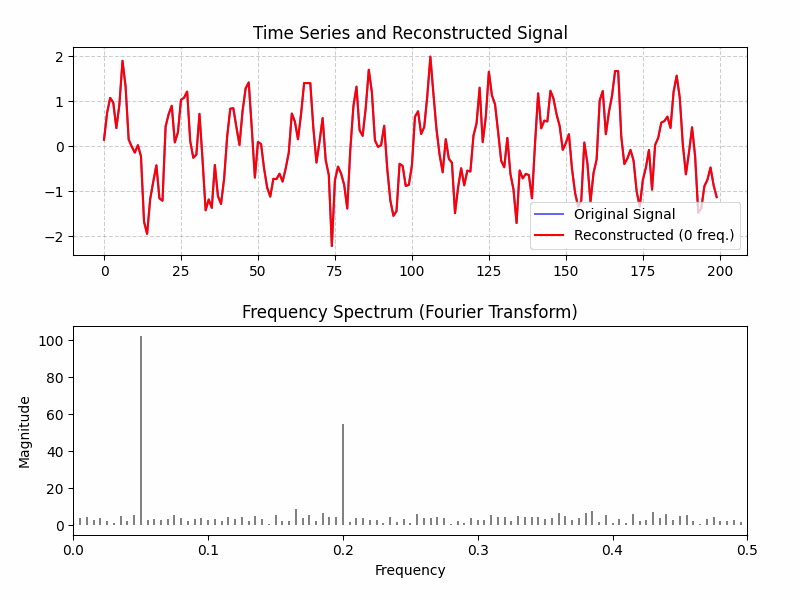

# Fourier Visualizer

A simple Python tool to visualize Fourier Transform on a time series.  
This project demonstrates how a signal can be decomposed into its frequency components and reconstructed step by step.

## Features

- Generate a simulated signal composed of multiple frequencies + noise.
- Visualize the original signal and its reconstruction using partial Fourier components.
- Animated GIF output showing how the signal is rebuilt from its frequency spectrum.
- Easy-to-understand visualization of the frequency spectrum.

## Demo

